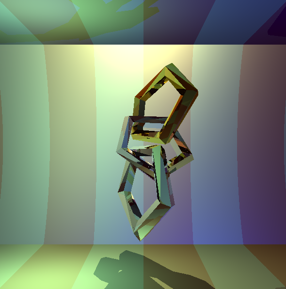

# grafika-hf2
Számítógépes grafika tárgy második házi feladata. A végeredmény kinézetre ugyan szép és max. pontos, de a megoldás közel sem tökéletes, így megtekintése csak saját felelősségre ajánlott.

Feladatleírás:
Egy véges magasságú, diffúz + spekuláris textúrázott henger belsejében szemlélődünk. A henger alakú szoba a látóterünkben még három optikailag sima, egymásba fonódó, darabonként max 50 háromszögre tesszellált, azaz „baltával faragott” tóruszt tartalmaz, az egyik arany, a másik üveg, a harmadik pedig ezüstből van. A tóruszok tengelyei nem párhuzamosak semelyik koordinátatengellyel. A színteret három, nem fehér fényforrás világítja meg és ambiens fény is észlelhető. A fényt tekintse polarizálatlannak, a Fresnel függvényt pedig tilos közelíteni.

Számítsa ki a látható képet sugárkövetéssel és jelenítse meg a képernyőn egy textúrázott téglalapként.

Az anyagtulajdonságok az R,G,B hullámhosszain: Optikailag sima arany (n/k: 0.17/3.1, 0.35/2.7, 1.5/1.9 ) Optikailag sima üveg: (n/k: 1.5/0, 1.5/0, 1.5/0) Optikailag sima ezüst (n/k: 0.14/4.1, 0.16/2.3, 0.13/3.1)

A szoba textúrája és diffúz/ambiens visszaverési együtthatói szabadon megválaszthatók. A fényforrások helye és intenzitása úgy választandó, hogy a kép szép és élvezhető legyen.

Beadó portál által renderelt kép:

